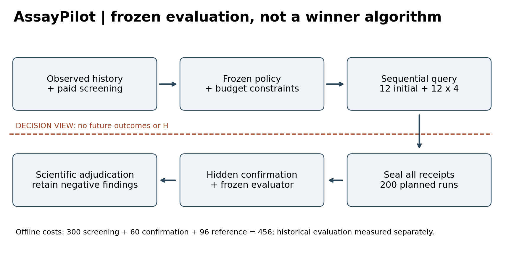
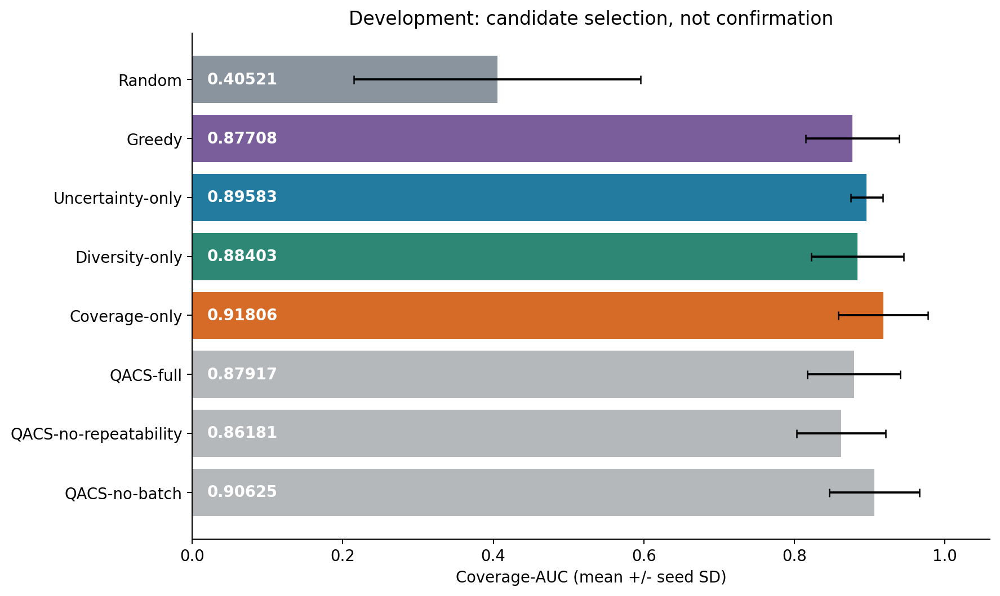
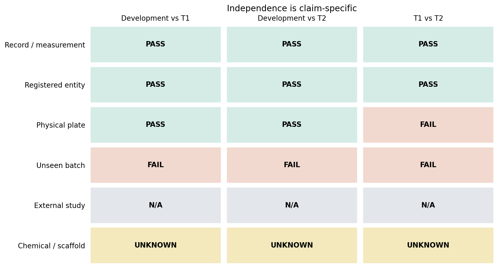
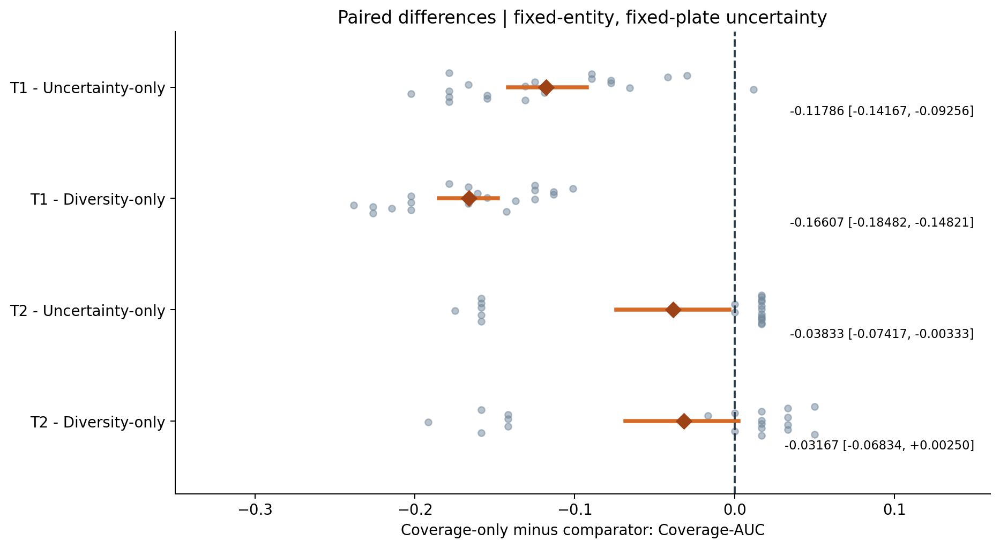
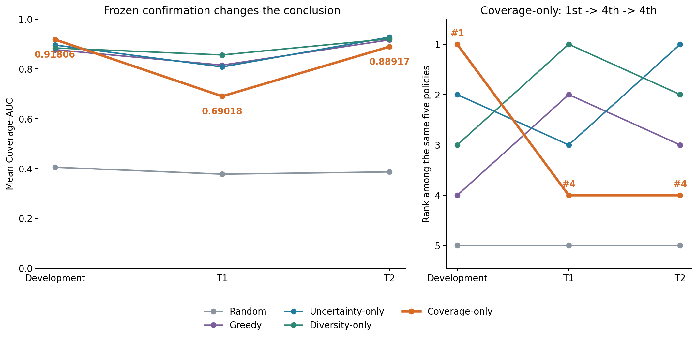
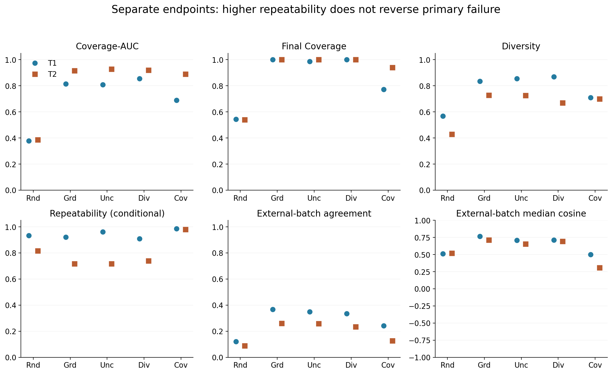

# AssayPilot: Auditable Policy Evaluation for Phenotype Discovery

Author: Lekang Sun (孙乐康)  
Affiliation: Beijing University of Technology (北京工业大学)  
Team: one member; leader and member Lekang Sun.  
Affiliation identifies the author's school and does not imply institutional endorsement or ownership.

Technical Report | 19 September 2026

**Status:** evaluation-framework contribution; no claim of a superior new selector. This document reports completed experiments; preparing this public competition snapshot did not run new experiments.

## 1. Abstract

Selecting experiments under a limited budget requires both a useful policy and credible evidence about that policy. Development scores alone can be misleading when a scientific decision system is selected and assessed on the same development setting. AssayPilot provides an auditable offline framework for budget-constrained sequential phenotype discovery, connecting saved selection histories, frozen preprocessing and reference definitions, identity audits, paired comparisons and claim-level adjudication. In the studied Cell Painting setting, coverage-only ranked first among five common policies during development with mean Coverage-AUC 0.91806. Under a frozen confirmation protocol, it ranked fourth in both fixed campaigns: 0.69018 in T1 and 0.88917 in T2. Diversity-only led T1 (0.85625), while Uncertainty-only led T2 (0.92750). All 200 planned confirmation runs completed. Paired mean differences against Uncertainty-only were negative in both campaigns, with saved bootstrap intervals excluding zero. These findings changed the policy-selection conclusion without changing the primary endpoint or discarding negative results. The contribution is a reproducible evaluation workflow and a bounded empirical demonstration of development-to-confirmation ranking instability, not a universally better experimental selector. Confirmation concerns registered entities and physical plates withheld from development within one study and a previously seen batch environment.

## 2. Introduction

An experimental-selection policy allocates limited observations to potentially informative conditions. A high development score is useful for selecting a candidate, but is not independent evidence that the selected policy will retain its advantage. This distinction matters when investigators can repeatedly inspect a small scientific dataset, propose additional objectives, and compare many policy variants. AssayPilot makes the transition from development to confirmation explicit, including the possibility that confirmation reverses the conclusion.

The present work has three contributions. First, an inspectable budgeted simulator separates policy-visible information from hidden evaluation outcomes and records a receipt for each trajectory. Second, a frozen confirmation process separates registered-entity, physical-plate, batch and study claims instead of treating any non-overlapping identifier as proof of generalization. Third, a documented comparison retains unsuccessful multi-objective variants and a development winner that failed confirmation. The integrated evidence chain is the contribution; its components are not claimed to be individually novel algorithms, and this report does not establish priority over all existing benchmark systems.

## 3. Scientific motivation

Cell Painting measurements characterize cellular morphology through many phenotype features. Investigators interested in diverse, reproducible phenotypic responses must choose which conditions warrant additional measurement. This task differs from maximizing one classification score: redundant selections can consume a budget, measurement agreement can vary, and laboratory context can affect observed profiles.

Our simulation studies selection for confirmation after an initial screening resource is available. It does not assume unmeasured candidate phenotypes can be observed for free: each campaign accounts for a 300-condition screening pool and a fixed reference cost of 96 alongside the confirmation budget. The framework offers a way to examine policy choices under these recorded assumptions. It has not demonstrated savings in a prospective wet-lab deployment, drug efficacy, or clinical benefit.

## 4. Problem formulation

Each fixed campaign contains 50 registered compounds and 300 conditions. The policy receives its allowed screening descriptors and observed confirmation history. An action selects a condition for the next confirmation query, subject to a cap of two doses per compound. Twelve initial conditions are followed by twelve rounds of four queries, yielding 60 confirmation queries. The final accounted online cost is 300 + 96 + 60 = 456. Hidden evaluation measurements are inaccessible to the selector and are evaluated after trajectories are sealed.

The frozen primary endpoint is the trapezoidal integral of coverage over confirmation budgets 12 through 60, divided by 48. Coverage is the fraction of available hidden-evaluation regions represented by selected conditions. The campaign-specific denominator means that absolute scores across Development, T1 and T2 are not interchangeable estimates of one population parameter. The principal comparison is the policy ranking within each campaign.

Secondary endpoints retain their frozen definitions: final coverage; discovery efficiency, (regions at 60 minus regions at 12)/48; entropy of supported hidden regions divided by log(8) for diversity; hidden repeat confirmation among online-positive selections for repeatability; and the saved cross-batch agreement/cosine diagnostics. Undefined denominators stay NA. These endpoints are not recombined into a new aggregate objective.

## 5. Dataset and compliance boundary

The source is the publicly documented LINCS Cell Painting resource [1]. The local project separates phenotype evidence from restricted or unresolved annotation rights. This report uses existing approved phenotype-derived results, registered identifiers, plate/batch metadata and provenance. Chemical structure, fingerprints, mechanism of action and target annotations are not used to establish chemical independence or to improve a policy.

The public snapshot contains result summaries, replay data, frozen parameter artifacts and source code for review. It does not contain raw augmented profiles, microscopy images or new candidate data. A copy of the phenotype CC0 reference is provided [2]; it is not a blanket license for every compound annotation or every derived asset. User-original project code is distributed in this competition snapshot without an additional open-source license; see the [Rights Notice](../RIGHTS_NOTICE.md). Third-party software and data retain their original ownership, licenses and usage conditions. Experimental metadata and derived-result lineage are documented, and restricted annotations and raw phenotype archives are excluded.

## 6. Evaluation framework

The framework connects five separable stages: permitted observations, budgeted policy actions, sealed selection receipts, hidden-outcome scoring, and scientific adjudication. The simulator enforces query limits and records selected conditions round by round. The frozen transform handles missing values, normalization and a ten-dimensional PCA representation without refitting on confirmation data. Its saved feature contract has 1,629 columns and its reference has eight regions. Exact executable definitions are retained in the archived source and configuration [3].

Figure 1. Offline budgeted evaluation, not automated wet-lab execution. All 300 screening observations are paid inputs. Twelve initial confirmations plus twelve rounds of four queries give 60 confirmations; 96 reference-control costs are recorded separately. Unpurchased confirmation and independent H remain outside the policy view. All trajectories are sealed before hidden evaluation. The framework can reject the development-selected policy claim.

The packaging layer is separate from this simulator. Figures and the browser demo read completed results and never query an evaluator or execute a selector. In the demo, hidden-outcome curves are shown only as post-seal replay, not as a signal that the original policy could inspect during selection. Receipts, manifests and artifact hashes link the displayed results back to the evidence files.

## 7. Policies and baselines

The formal comparison contains Random, Greedy, Uncertainty-only, Diversity-only and coverage-only. Random supplies a budget-matched reference. Greedy uses the existing screening-strength rule; Uncertainty-only uses the frozen neighbor-based uncertainty rule; Diversity-only selects according to the existing distance-based diversity criterion. Coverage-only is the archived AblationQACS implementation with variant QACS-coverage-only and weights (1, 0, 0, 0). The historical class name is retained for reproducibility and is not a claim that QACS was successful.

All five methods use the same campaign, seed policy, budgets, preprocessing, reference and evaluator. The archived source is authoritative for tie handling and numerical details; this packaging did not alter it. Multi-objective QACS variants, constrained and lexicographic successors belong to development evidence, not to the five-method formal confirmation. No selector was trained or retuned for this report.

## 8. Development evaluation

Development was used to choose the candidate and is therefore selection evidence, not independent validation. Among the five methods subsequently compared in confirmation, coverage-only ranked first, with mean Coverage-AUC 0.91806. Table 1 and Figure 2 retain the original means and sample standard deviations and show the additional development variants as context. They are not pooled with confirmation observations.

**Table 1. Development-only means and sample seed SD (20 seeds); additional QACS rows are exploratory, not confirmation.**

| Method | AUC | Seed_SD | Seeds |
| --- | --- | --- | --- |
| Random | 0.40521 | 0.19047 | 20 |
| Greedy | 0.87708 | 0.06244 | 20 |
| Uncertainty-only | 0.89583 | 0.02137 | 20 |
| Diversity-only | 0.88403 | 0.06146 | 20 |
| Coverage-only | 0.91806 | 0.05947 | 20 |
| QACS-full | 0.87917 | 0.06176 | 20 |
| QACS-no-repeatability | 0.86181 | 0.05914 | 20 |
| QACS-no-batch | 0.90625 | 0.05989 | 20 |

Figure 2. Development-only mean Coverage-AUC, with seed standard deviations (not confidence intervals). Coverage-only leads at 0.91806. QACS-full and two single-term ablations are exploratory development evidence, not confirmation runs. The later constrained and lexicographic variants remain in the negative-results supplement.

Phase15 did not support the multi-objective QACS formulation. Its weighted-sum and principled-successor experiments are retained in the negative-results artifacts [4]. The appropriate inference is that the tested proxies did not establish a stable advantage in this evidence, not that every multi-objective approach is ineffective. The development superiority of coverage-only justified freezing a candidate, but did not justify calling it confirmed.

## 9. Frozen confirmation design

The formal method fingerprint is `009d78b97ac2d1d47986fd13e3f5592c01c8e0b0e09ab9063d20cfe6a364bda7`. The split-manifest hash is `52e61d9c7136907226776cfe69895004890234916f5617492c71a4010392b45a`. Frozen method, preprocessing, reference, metric definitions, seeds and costs are documented in the saved manifests [3,5]. Both campaigns used seeds 0 through 19 for each of five methods: 2 x 5 x 20 = 200 planned runs.

The initial Phase16 review stopped before performance evaluation because independence evidence was incomplete. Phase16A subsequently authorized claim-scoped confirmation after its identity audit. Confirmation vectors had been accessed for identity/hash/near-duplicate auditing; claiming the phenotype files had never been opened would be false. The relevant separation was that policy performance, reward and coverage had not been calculated or used for policy choice before the formal confirmation.

The formal confirmation then completed 200 runs with zero failures. Preflight and receipt/statistics verification records are retained. Technical attempt records remain archived and are not erased by the final successful status. The outcome is C — COVERAGE_ONLY_NOT_CONFIRMED, now based on actual performance evidence. T1/T2 are performance-exposed and cannot independently confirm a later method informed by these outcomes.

## 10. Independence audit

The Phase16A audit found registered compound, sample, condition, measurement and replicate ancestry isolated between Development and each fixed campaign. Physical plates used for T1/T2 were not used for Development. However, T1 and T2 share eight physical plates and both inhabit the previously exposed batch2 environment. Chemical/scaffold equivalence is unknown; external-study evidence is absent. Shared batch context is not automatically identity leakage, but it prevents an unseen-batch claim.

**Table 4. Operational independence claims inherited from Phase16A; shared context is not automatically record leakage.**

| Identity level | Development vs T1 | Development vs T2 | T1 vs T2 |
| --- | --- | --- | --- |
| Record / measurement | PASS | PASS | PASS |
| Registered entity | PASS | PASS | PASS |
| Physical plate | PASS | PASS | FAIL |
| Unseen batch | FAIL | FAIL | FAIL |
| External study | N/A | N/A | N/A |
| Chemical / scaffold | UNKNOWN | UNKNOWN | UNKNOWN |

Figure 6. Identity and claim hierarchy inherited from Phase16A. Each confirmation campaign uses registered entities and physical plates absent from development, but T1 and T2 share eight physical plates and all use a previously seen batch environment. Chemical/scaffold independence is unknown. External-study validation is not part of this design (N/A). PASS concerns the stated operational level only.

The matrix reports evidence for each distinct claim. PASS does not mean molecularly novel compounds. FAIL in the shared-batch or T1-versus-T2 plate cells denotes failure of that stronger isolation claim, not proof of identical records. The defensible confirmation scope is same-study, seen-batch, unseen registered entities and physical plates withheld from development.

## 11. Confirmation results

Table 2 reports the primary endpoint with mean, median, sample standard deviation, valid seeds and failure/NA accounting. Each campaign is analyzed separately; the two campaigns are not treated as forty independent biological replicates.

**Table 2. Primary Coverage-AUC by fixed campaign and policy; sample SD uses ddof=1; valid/failed/NA seeds are explicit.**

| campaign | method | mean | median | std | valid_seeds | failed_seeds | na_seeds |
| --- | --- | --- | --- | --- | --- | --- | --- |
| T1 | coverage-only | 0.69018 | 0.67857 | 0.05635 | 20 | 0 | 0 |
| T1 | diversity | 0.85625 | 0.85119 | 0.03358 | 20 | 0 | 0 |
| T1 | greedy | 0.81518 | 0.80060 | 0.03320 | 20 | 0 | 0 |
| T1 | random | 0.37768 | 0.35119 | 0.13959 | 20 | 0 | 0 |
| T1 | uncertainty | 0.80804 | 0.80655 | 0.04119 | 20 | 0 | 0 |
| T2 | coverage-only | 0.88917 | 0.92917 | 0.08520 | 20 | 0 | 0 |
| T2 | diversity | 0.92083 | 0.92500 | 0.02683 | 20 | 0 | 0 |
| T2 | greedy | 0.91667 | 0.91667 | 0.02041 | 20 | 0 | 0 |
| T2 | random | 0.38667 | 0.37083 | 0.16718 | 20 | 0 | 0 |
| T2 | uncertainty | 0.92750 | 0.93333 | 0.01712 | 20 | 0 | 0 |

Coverage-only obtained 0.69018 in T1 and 0.88917 in T2. Diversity-only led T1 at 0.85625; Uncertainty-only led T2 at 0.92750. Coverage-only was fourth in both five-method rankings. Its confirmation superiority was not reproduced.

Table 3 and Figure 4 use the saved paired differences and original bootstrap estimates, without recomputing a bootstrap in packaging. The original plan resampled twenty within-campaign seed pairs 10,000 times using RNG seed 1600 and percentile 2.5/97.5 bounds for their mean difference. These intervals describe initial-selection-seed uncertainty conditional on fixed entities and plates. They are not population, biological or cross-batch confidence intervals.

**Table 3. Coverage-only minus comparator, paired by seed within each campaign; percentile bootstrap intervals are conditional on fixed entities and plates.**

| campaign | comparator | valid_pairs | planned_pairs | mean | median | std | ci_low | ci_high | wins | ties | losses |
| --- | --- | --- | --- | --- | --- | --- | --- | --- | --- | --- | --- |
| T1 | uncertainty | 20 | 20 | -0.11786 | -0.12798 | 0.05869 | -0.14167 | -0.09256 | 1 | 0 | 19 |
| T1 | diversity | 20 | 20 | -0.16607 | -0.16369 | 0.04309 | -0.18482 | -0.14821 | 0 | 0 | 20 |
| T2 | uncertainty | 20 | 20 | -0.03833 | 0.01667 | 0.08269 | -0.07417 | -0.00333 | 12 | 2 | 6 |
| T2 | diversity | 20 | 20 | -0.03167 | 0.01667 | 0.08527 | -0.06834 | 0.00250 | 11 | 2 | 7 |

Figure 4. Coverage-only minus each strong comparator, paired by seed. Points are the 20 saved differences; diamonds and bars are the saved paired means and percentile bootstrap 95% intervals (10,000 resamples, RNG seed 1600). Intervals describe initial-seed uncertainty conditional on fixed entities and plates, not population or biological uncertainty. The T2 versus Diversity interval includes zero.

Coverage-only minus Uncertainty-only was -0.11786 in T1 (95% CI [-0.14167, -0.09256]) and -0.03833 in T2 ([-0.07417, -0.00333]). Against Diversity-only the differences were -0.16607 ([-0.18482, -0.14821]) and -0.03167 ([-0.06834, +0.00250]). The last interval includes zero and must not be reported as a clear negative effect across the conditional seed distribution. The mean-ranking failure nevertheless holds in both campaigns. A majority of seed-level wins in a comparator pair, where present, is not the frozen mean-AUC adjudication criterion.

## 12. Development-to-confirmation ranking instability

Figure 3. The same five policies across development and the two frozen confirmation campaigns. Coverage-only changes from rank 1 to rank 4 in both T1 and T2. Diversity-only leads T1 and Uncertainty-only leads T2. Lines connect dataset summaries, not longitudinal observations. AUC uses its full 0-1 scale. The campaigns share plates and a previously seen batch environment.

Coverage-only moved from rank 1 in Development to rank 4 in T1 and rank 4 in T2. The leading policy also differed between the two confirmation campaigns. This is a concrete case in which development-only policy selection would have supported a stronger conclusion than fixed confirmation permits.

The figure shows full-range AUC and a separate ordinal ranking panel. Lines connect evaluation settings, not time points or independent biological replications. The ranking change cannot isolate one causal explanation: candidate composition, coverage geometry, measurement variation and other setting differences may contribute. No post-outcome algorithm search was performed here. The result does not prove that coverage objectives generally fail or that Diversity-only or Uncertainty-only is universally optimal.

## 13. Secondary-metric trade-offs

**Table 5. Final secondary means over 20 seeds and positive-selection denominator counts; batch diagnostics do not establish unseen-batch generalization.**

| Campaign | Method | Final_Coverage | Diversity | Repeatability | Batch_agreement | Batch_cosine | Online_positive_mean | Repeated_positive_mean |
| --- | --- | --- | --- | --- | --- | --- | --- | --- |
| T1 | Random | 0.54286 | 0.56716 | 0.93315 | 0.12000 | 0.51374 | 7.45000 | 6.85000 |
| T1 | Greedy | 1.00000 | 0.83424 | 0.92200 | 0.36750 | 0.76501 | 22.30000 | 20.55000 |
| T1 | Uncertainty-only | 0.98571 | 0.85614 | 0.96118 | 0.34917 | 0.70793 | 20.25000 | 19.45000 |
| T1 | Diversity-only | 1.00000 | 0.86934 | 0.90929 | 0.33417 | 0.71384 | 21.45000 | 19.50000 |
| T1 | Coverage-only | 0.77143 | 0.70991 | 0.98504 | 0.24250 | 0.50184 | 14.65000 | 14.45000 |
| T2 | Random | 0.54000 | 0.42910 | 0.81518 | 0.08750 | 0.51804 | 5.80000 | 4.65000 |
| T2 | Greedy | 1.00000 | 0.72683 | 0.71708 | 0.25917 | 0.71064 | 17.50000 | 12.55000 |
| T2 | Uncertainty-only | 1.00000 | 0.72566 | 0.71708 | 0.25833 | 0.65606 | 17.50000 | 12.55000 |
| T2 | Diversity-only | 1.00000 | 0.66885 | 0.73967 | 0.23417 | 0.69125 | 16.15000 | 11.95000 |
| T2 | Coverage-only | 0.94000 | 0.70008 | 0.97946 | 0.12667 | 0.30801 | 7.65000 | 7.50000 |

Figure 5. Separate constructs, not a composite score. Saved means over 20 seeds per campaign show higher conditional Repeatability for coverage-only, alongside lower final coverage and weaker external-batch agreement/cosine than strong baselines. Repeatability conditions on online-positive selections; its denominators are included in Table 5. Secondary outcomes do not replace Coverage-AUC.

Coverage-only retained high conditional repeatability. In T1 it was 0.98504, compared with 0.96118 for Uncertainty-only and 0.90929 for Diversity-only; in T2 it was 0.97946, compared with 0.71708 and the Diversity-only value in Table 5. This ratio conditions on online-positive selections. It must be read together with its denominator: mean online-positive counts for coverage-only were 14.65 and 7.65 in T1/T2, versus 20.25 and 17.50 for Uncertainty-only. Mean repeat-confirmed counts were correspondingly 14.45 and 7.50 versus 19.45 and 12.55. A higher conditional fraction does not establish a larger number of confirmed discoveries.

Final coverage was also lower for coverage-only: 0.77143 in T1 and 0.94000 in T2, versus 0.98571 and 1.00000 for Uncertainty-only. Saved batch agreement and cosine diagnostics were lower than those of the key baselines in both campaigns. These diagnostics compare the original batch2 online pair mean against a batch1 single profile; they are auxiliary cross-context measurements, not a new unseen-batch policy confirmation. Discovery efficiency and all secondary mean/median/sample-SD/NA fields are preserved in the [supplementary full-metrics table](../tables/supplement_full_metrics.md).

The observed trade-off is scientifically relevant but cannot replace Coverage-AUC after results are known. Neither a local repeatability benefit nor strong development evidence changes the formal confirmation adjudication.

## 14. Scientific implications

AssayPilot illustrates how evaluation design can change the research decision even when it does not produce a winning algorithm. Freezing the candidate, auditing what is independent, pairing stochastic initializations and retaining unsuccessful approaches protect against a development-only narrative. The reproducible output is the chain of decisions and evidence, including its negative endpoint.

The result supports a methodological practice in this setting: distinguish policy selection from confirmation and make the level of independence explicit. It is an empirical demonstration, not a theorem about adaptive experimentation. The report's AI-for-science relevance comes from evaluating resource-constrained scientific decisions with auditable evidence. Algorithmic novelty, external validation and prospective impact remain limited; this report does not establish top-three competition competitiveness.

## 15. Limitations

Only one study and a previously seen batch environment are represented. T1/T2 share physical plates and are not independent biological plate replications. Registered-entity isolation does not establish chemical structure or scaffold isolation. The available confirmation entities and the fixed reference define the evaluated regimes; bootstrap uncertainty does not represent new studies, new batches or the population of molecules. Campaign-specific coverage denominators limit direct interpretation of absolute AUC changes across settings.

This is a retrospective offline simulation, including assumptions about screen availability, experimental costs and phenotype-region definitions. It does not establish real wet-lab benefit, drug discovery efficacy or clinical utility. No systematic external novelty review or formal theoretical guarantee is claimed. Later work using T1/T2 to design a policy would require new untouched evaluation evidence. This report is included in the minimal competition submission snapshot under the repository's Rights Notice.

## 16. Reproducibility

The public snapshot contains saved results, paired statistics, demo replay data, archived policy source, frozen configurations, a file hash index, per-figure source records and a claim-evidence matrix. The reproduction path is figure-only/report-only: no raw data, scientific runners, selector execution or model training is needed. `python reproducibility/render_saved_results.py` rebuilds figures and tables; `python reproducibility/render_report.py` rebuilds HTML; `python reproducibility/verify_saved_artifacts.py` checks copied evidence hashes. See the environment records and reproducibility README [7].

A full experiment reproduction is a separate, data-dependent operation and is outside this minimal snapshot. The supplied commands do not imply an executed full rerun. Early-round undefined values in the demo are displayed as NA rather than silently converted to zero. Authoritative negative-result tables are retained.

## 17. Conclusion

Frozen confirmation changed the policy-selection conclusion: coverage-only's development lead was not retained on either fixed campaign. AssayPilot packages this bounded finding in an auditable workflow linking sequential decisions, identity-aware confirmation, conditional uncertainty and explicit claim limits. The project is an evaluation contribution and a reproducible empirical case, not a claim of a new superior selector.

### Author responsibility and AI disclosure

AI-assisted development tools, including ChatGPT and Codex, were used for code drafting, debugging, documentation, consistency checks, and workflow support. The research question, experimental design, evaluation protocol, scientific decisions, interpretation of results, release decisions, and final verification were directed and reviewed by the author, Lekang Sun.

Single-person project by Lekang Sun; school affiliation is not an assertion of institutional endorsement or ownership. [Recorded authorship and code statement](../docs/AUTHORSHIP_AND_AI_DISCLOSURE.md).

### Tools and attribution

[Dataset citation, dependency notices and AI-assistance disclosure](../THIRD_PARTY_NOTICES.md) form part of this report. Author identity, affiliation and the AI-use declaration are recorded in this snapshot.

## 18. References and evidence locators

1. LINCS Cell Painting public project documentation: https://github.com/broadinstitute/lincs-cell-painting . Official README and CC0 snapshots were verified during Phase20; Phase21 reuses their hashes and recorded access date.
2. [Archived phenotype license reference](../docs/DATA_CC0_REFERENCE.md). Scope and metadata exclusions are discussed in the [data boundary](../docs/DATA_AND_LICENSE.md).
3. [Frozen method/configuration](../configs/frozen_method.json), [preprocessing](../configs/preprocessing.json), [reference](../configs/reference.json), and archived [source](../src/).
4. [Development aggregates](../results/development/comparison_aggregate.csv), [Phase15 secondary metrics](../results/negative_results/phase15_secondary_metrics.csv), and [per-seed negative evidence](../results/negative_results/phase15_summary_by_seed.csv).
5. [Formal run manifest](../results/confirmation/run_manifest.json), [adjudication](../results/confirmation/final_adjudication.json), [saved summaries](../results/confirmation/summary_metrics.csv), [bootstrap estimates](../results/confirmation/bootstrap_ci.csv).
6. [Identity overlap matrix](../results/audit/overlap_matrix.csv) and [independence adjudication](../results/audit/adjudication.json).
7. [Reproducibility instructions](../reproducibility/README.md), [artifact index](../reproducibility/artifact_index.json), and [claim-evidence matrix](../docs/final_claim_evidence_matrix.csv).
